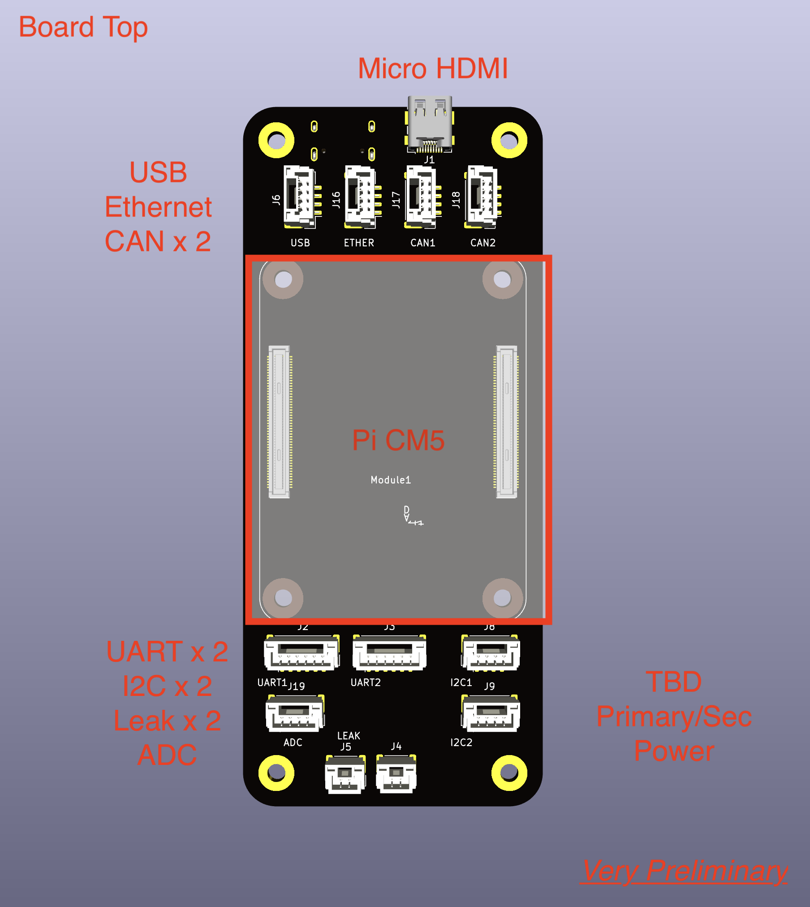
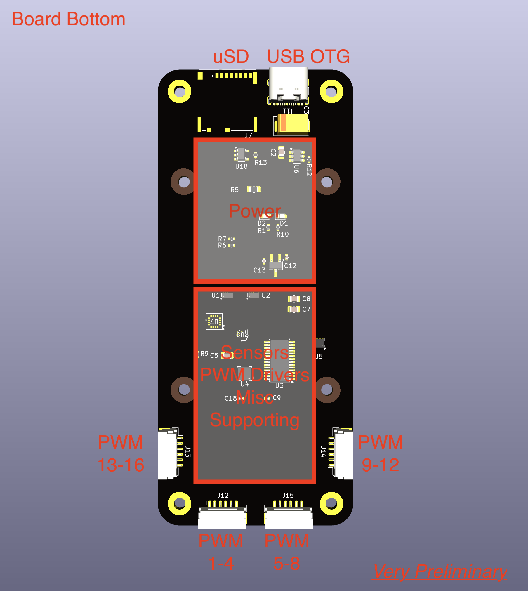

# compactPi

compactPi is a project to develop a compact Raspberry Pi Compute Module carrier suitable for ArduPilot applications. It's primarily targeted at marine applications (ArduSub/ArduRover).

## Milestones

Given that this is a side project for me, I am being very conservative with these milestones. You may also note that it is a pretty long board assembly turn time to keep costs maneagble. Macrofab is the current turnkey vendor planned for use, although the design will target JLPCB & similar low-cost vendors in terms of complexity.

| # | Description | Estimated Time Frame| Status |
|---|---|---|---|
| 1 |Feature freeze | Mid-Feb | On Track |
| 2 |Schematic/layout draft ready for review | Early march | In Work |
| 3 |Gerbers ready for review | End of march | TBD |
| 4 |PCB Tape Out | Mid April | TBD |
| 5 |Board Fab & Build | June/July (assuming 30 day turn for initial prototypes to keep costs maneagable)| TBD |
| 6 |Validation/Verification Complete| TBD | TBD |
| 7 |V1.0 Design File Release| TBD (dependent on how well the first rev does) | TBD |

# Layout Study (PRELIMINARY)

# Design Details (PROPOSED)

## Power/Physical
| # | Description | Value/Units | Notes |
|---|---|---|---|
| 1 |Input Voltage range| 6-25V | 2 independent inputs + USB-C PD option |
| 2 |Mainboard power dissipation | 25W | |
| 3 |Dimensions | 45mm x 105mm | Evaluating options for shrinking length without over-crowding connectors|

## Key Sensors
| # | Description | Part Number | 
|---|---|---|
| 1 |6 Axis IMU | ICM-20602 |
| 2 |3 Axis Magnetometer | MMC5983 |
| 3 |3 Axis Compass | AK09915 |
| 4 |Barometer | BMP280 |
| 5 |ADC | TBD |

## Interfaces
| # | Description | Form Factor | Qty | Notes |
|---|---|---|---|---|
| 1 |UART | JST-GH BM06B | 2 |  |
| 2 |I2C | JST-GH BM04B | 2 |  |
| 3 |SBUS | TBD |1| |
| 4 |5V PWM Quad Out | JST-GH BM06B | 4 | 4 PWM channels per connector, 16 total per carrier|
| 5 |Leak Sensor | JST-GH BM02B | 1 | |
| 6 |ADC | TBD | TBD| |
| 7 |HDMI | HDMI-C | 1 | |
| 8 |Ethernet 10/100| JST-GH BM04B | 1 | |
| 9 |USB| 1x JST-GH BM04B/ 1x USB-C OTG | 2 | |
| 10 |SD| micro-SD | 1 | |
| 11 |Power | TBD | 2 | |
| 12 |CAN Bus | JST-GH BM04B | 2 | |

